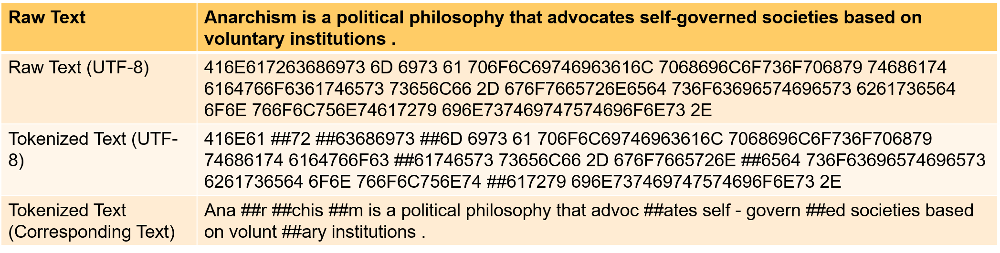

# Byte-Level Vocabulary Building Tool


## Introduction

In this project, we provide a byte-level vocabulary building tool and its correspoinding tokenizer. We employed a technique, namely Byte-Level Byte Pair Encoding (BBPE) in building the vocabulary. Specifically, this BBPE first converts the text into its corresponding UTF-8 codes and then applies Byte Pair Encoding (BPE) on the UTF-8 codes. There are strong experimental evidences showing that building the multilingual vocabulary in a byte-level will largely encourage the sharing of subwords among different words in a fine-grain, as a result of which, the learning of the representations of rare words could be improved. To intuitively give an idea of this BBPE, we demonstrate an example in the figure example.png. In this figure, there are four lines which correspond to the raw text, the UTF-8 encoding of the text, the tokenized UTF-8 encoidng of the text and the corresponding text of the tokenized UTF-8 encoding, respectively. Each word contains several characters and we convert each character into bytes and preserve the boundary of each word (i.e., whitespace). By applying BPE to the UTF-8 encoding of the text, we obain a byte-level vocabulary. The tokenization using the vocabulary is shown in the third line and the last line shows the corresponding text of the tokenized UTF-8 encoding. Note that the symbol "##" denotes the subword is an trailing subword (i.e., the subword is not in beginning of the word it belongs to). We refer the readers to our technical report for more details (https://arxiv.org/abs/2101.09469).


<br />

This project contains two parts: A. BBPE vocabulary building B. byte-level tokenizer

## A. BBPE vocabulary building


unzip bbbp.zip and go to the folder bbpe and perform the following steps. 

### Step 1: text preprocessing

* the step converts raw text into its corresponding UTF-8 codes and assumes that the raw text files are under the folder 'MTData' and the converted files are under the folder 'MTData_byte'. The converted files will be used to build the vocabulary. Under the folder, there is a file 'protectList.tx' which contains several protected words such as '=NUMBER='，'=QUANTIFIER='. And these protected words will not be involved in building the vocabulary. Users may customerize the protectList.txt by themselves. The commands of this step are as follows. 

```
mkdir MTData_byte

bash text2utf-8-mt-byte.sh
```

* Note: the above source codes assume that the Chinese, Korean and Japanese text is in their natural format without any word boundary information (i.e., we assume that there is no whitespace on the boudary of each words). If your Chinese, Korean and Japanese text is tokenizied (i.e., each word has whitespaces on its boundary), please change the code 'if len(getCJK(token)) > 0 or len(getPunc(token)) > 0: ' in both line 132 and line 156 in utf-8-mt-byte.py to be 'if len(getPunc(token)) > 0: '.

### Step 2: byte-level BPE

* The commands of this step are as follows. 

```
cat MTData_byte/* > MTData_byte.txt

cd fastBPE-master

g++ -std=c++11 -pthread -O3 fastBPE/main.cc -IfastBPE -o fast

./fast learnbpe 40000 ../MTData_byte.txt > vocab_bytes.txt
```

Here we use fastBPE (https://pypi.org/project/fastBPE/) as our underlining BPE tool and please download the tool and put the compiled file 'fast' under the folder fastBPE-master（please refer https://en.wikipedia.org/wiki/Byte_pair_encoding to the details of BPE）

* Note: By default, the tool fastBPE will insert a special symbol "</w>" in the end of each word but our BBPE tool does not need that symbol. Thus, please replace the symbol "</w>" with "" in the source code of fastBPE. 

### Step 3: vocabulary postprocessing

* the following command converts the bytes in the vocabulary to their corresponding hexadecimal digits for the better readability. 

```
cat vocab_bytes.txt | python3 vocab_byteTo16base.py vocab_byteTo16base.txt

cd ..
```

* the following command inserts single-byte characters into the vocabulary 

```
python3 mergeVocab.py charVocab.txt fastBPE-master/vocab_byteTo16base.txt ./vocab_utf8.txt
```

* the following command sort the vocabulary by the frequency and outputs two files: vocab_byte_display.txt and vocab_bpe.txt。

```
cat vocab_utf8.txt | python3 map_freq.py vocab_bbpe_display.txt vocab_bbpe.txt
```

Each line in the file vocab_bbpe_display.txt corresponds to a subword (i.e., a token) in the vocabulary and each line has 3 columns: UTF-8 codes in hexadecimal digits of the subword | the corresponding raw text of the subword (if it has no corresponding raw text, we simply display '0x' + this subword) | frequency of the subword. vocab_bbpe.txt has only one culumn which is the same as the first column of vocab_bbpe_display.txt. 

The file vocab_bbpe.txt is the final BBPE vocabulary which could be used in our tokenizer. And the file vocab_bbpe_display.txt is for your checking of the correctness. 

* Note: the tool won't insert special characters such as [CLS], [MASK], [SEP]. You may mannually insert them if needed. 


## B. Tokenizer (for training or inference)

* source code: tokenization.py

* usage：

```
import tokenizationBBPE as tokenization

tokenizer = tokenization.FullTokenizer(
      vocab_file=vocab_file, do_lower_case=False, CJK_tokenize=True)

tokens = tokenizer.tokenize(line)
```

* the vocab_file is the BBPE vocabulary, do_lower_case is a boolean variable (the input text will be converted into lower-case character if it is set to be true) and CJK_tokenizer is also a boolean variable. If it is False, we will insert a whitespace before and after each input CJK (i.e., Chinese, Japanese and Korean) character in the text before the tokenization. As such, each output token will contain at most one CJK character. If it is True, then we feed the original text to the tokenizer and each output token could contain one or more CJK characters (e.g., E58D97E58C97 which corresponds to "南北"). 

* tokenization.printable_text_byte(x) could convert a UTF-8 code in hexadecimal digits of the subword such as 426168617361 into its corresponding raw text, in this example, the correspondig raw text is Bahasa. Thus, the function could be used to check the corresponding raw text of the tokenization results. 

## Reference
Junqiu Wei and Qun Liu and Yinpeng Guo and Xin Jiang.
[Training Multilingual Pre-trained Language Model with Byte-level Subwords](https://arxiv.org/abs/2004.04037).

```
@misc{wei2021training,
    title={Training Multilingual Pre-trained Language Model with Byte-level Subwords},
    author={Junqiu Wei and Qun Liu and Yinpeng Guo and Xin Jiang},
    year={2021},
    eprint={2101.09469},
    archivePrefix={arXiv},
    primaryClass={cs.CL}
}
```