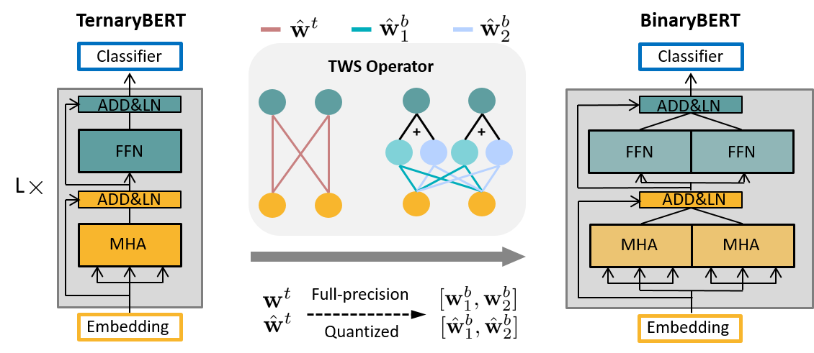

# BinaryBERT: Pushing the Limit of BERT Quantization
This repository contains the implementation of our paper 
"BinaryBERT: Pushing the Limit of BERT Quantization" 
in ACL 2021. 
The overall workflow of training BinaryBERT is shown below.
We first train a half-sized ternary BERT model, and then apply **ternary weight splitting** 
to initalize the full-sized BinaryBERT. We then fine-tune BinaryBERT for further refinement.


## Dependencies
```bash
pip install -r requirements.txt
```

## Datasets

We train and test BinaryBERT on GLUE and SQuAD benchmarks. Both dataset are available online:
- **GLUE**: https://github.com/nyu-mll/GLUE-baselines
- **SQuAD**: https://rajpurkar.github.io/SQuAD-explorer/

For data augmentation on GLUE, please follow the instruction in [TinyBERT](https://github.com/huawei-noah/Pretrained-Language-Model/tree/master/TinyBERT).

## Execution 
Our experiments are based on the fine-tuned full-precision DynaBERT, 
which can be found [here](https://drive.google.com/file/d/1pYApaDcse5QIB6lZagWO0uElAavFazpA/view?usp=sharing).
Complete running scripts and more detailed tips are provided in `./scripts`.
There are two steps for execution, and we illustrate them
with training BinaryBERT with 4-bit activations on MRPC.

### Step one: Train a half-sized ternary BERT
This correponds to `scripts/ternary_glue.sh`.  For example
```bash
sh scripts/terarny_glue.sh mrpc data/mrpc/ models/dynabert_model/mrpc/width_0.5_depth_1.0/ models/dynabert_model/mrpc/width_0.5_depth_1.0/ 2 4
```

### Step two: Apply TWS and finetune BinaryBERT
This correponds to `scripts/tws_glue.sh`. Based on the model checkpoint of ternary BERT, execute:
```bash
sh scripts/tws_glue.sh mrpc data/mrpc/ models/dynabert_model/mrpc/width_0.5_depth_1.0/ output/Ternary_W2A8/mrpc/kd_stage2/ 1 4
```
Go through each script for more detail.

## Citation
If you find this repo helpful for your research, please: 
```
@inproceedings{bai2021binarybert,
	title={BinaryBERT: Pushing the Limit of BERT Quantization},
	author={Bai, H. and Zhang, W. and Hou, L. and Shang, L. and Jin, J. and Jiang, X. and Liu, Q. and Lyu, M. and King, I.},
	booktitle={Annual Meeting of the Association for Computational Linguistics},
	year={2021}
}
```