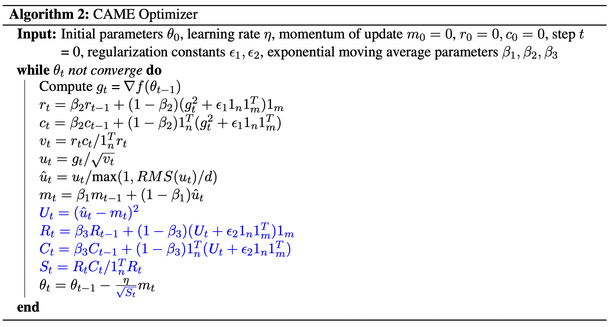
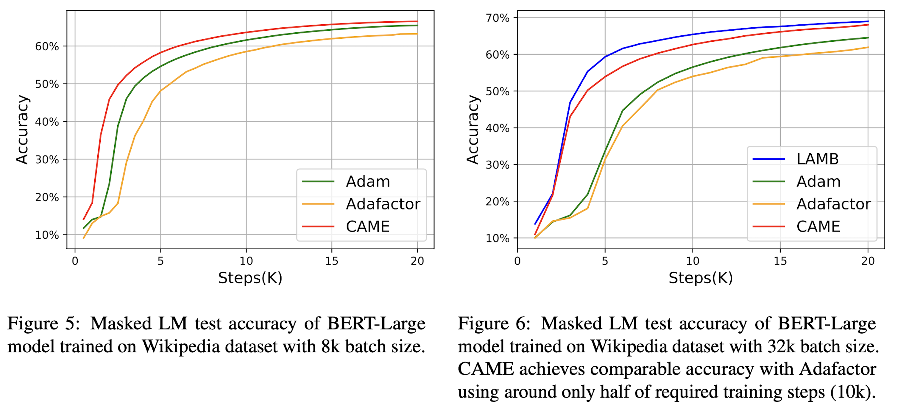
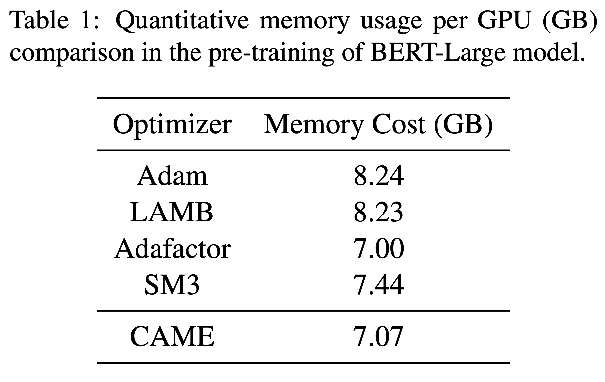

# CAME Optimizer - Pytorch

This repository provides a script and recipe to train the BERT model with our proposed CAME optimizer in:

CAME: Confidence-guided Adaptive Memory Efficient Optimization

This work has been accepted by **ACL2023** main conference.

In this work, we studied a confidence-guided strategy to reduce the instability of existing memory efficient optimizers. 
Based on this strategy, we proposed CAME to simultaneously achieve two goals: fast convergence as in traditional adaptive methods, and low memory usage as in memory-efficient methods.


## Training

### The script including the setting of hyperparameters to pretrain BERT:
bash run_came_pretraining.sh  

### The startup file corresponding to the script:  
startup_came.py  

### Pytorch implementation:  
came.py: the Pytorch implementation of our proposed CAME optimizer.


## Pretraining Results


## Memory Usage Comparison


## Usage
```
from came import CAME
optimizer = CAME(model.parameters(), lr=2e-4, weight_decay=1e-2, betas=(0.9, 0.999, 0.9999), eps=(1e-30, 1e-16))
```
## Citation
