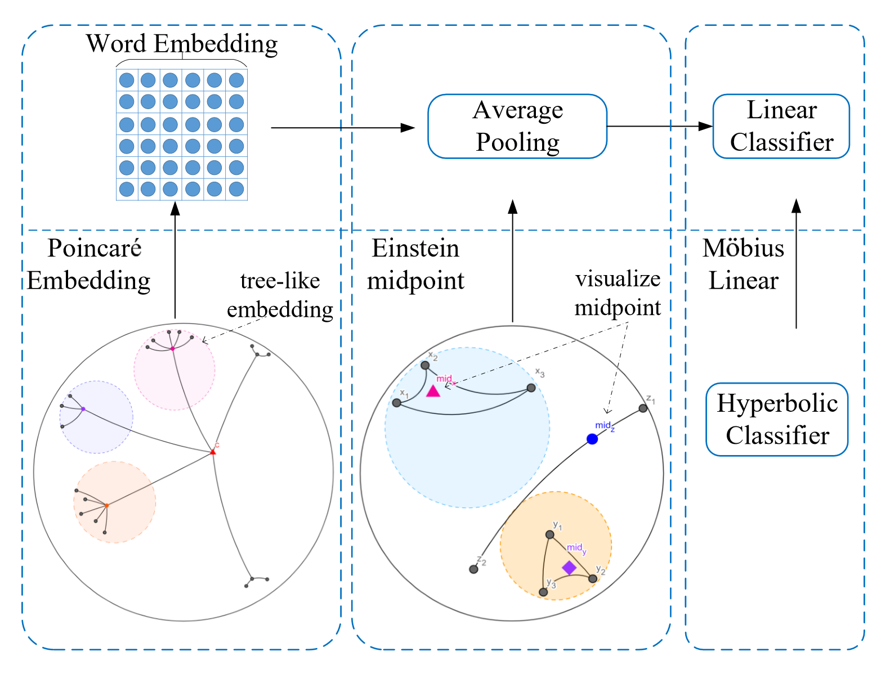

#  HyperText 
Natural language data exhibit tree-like hierarchical structures such as the hypernymhyponym relations in WordNet. Considering that hyperbolic space is naturally suitable for modeling tree-like hierarchical data, we propose a new model named HyperText for efficient text classification by endowing FastText with hyperbolic geometry. Empirically, we show that HyperText outperforms FastText on a range of text classification tasks with much reduced parameters.  



For more details about the techniques of HyperText,  please refer to our paper:  

[HyperText: Endowing FastText with Hyperbolic Geometry](https://arxiv.org/abs/2010.16143 "HyperText: Endowing FastText with Hyperbolic Geometry")

#  Release Notes

First version: 2021.01.16

# Installation
Run command below to install the environment(using python3)  
```python

pip install -r requirements.txt  

```

# Train and Evaluation  
* Data Preprocessing  
  please refer to our paper for details

* Train & Evaluation

```python

python main.py --datasetdir $data_path --outputdir $output_path --dropout $droout --require_improvement $early_stopping_steps --num_epochs $max_epoch --batch_size $batch_size --max_length $max_sequence_length --learning_rate $learning_rate --embed_dim $embedding_dimension --bucket $hash_bucket_size --wordNgrams $word_ngram --eval_per_batchs $evaluation_frequency --min_freq $minimum_word_frequency --lr_decay_rate $learning_rate_decay

```

# Examples  

* TNEWS Dataset


```python

python main.py --datasetdir ./data/tnews_public --outputdir ./output --dropout 0.0 --require_improvement 6000 --num_epochs 50 --batch_size 32 --max_length 40 --learning_rate 1.1e-2 --embed_dim 200 --bucket 1500000 --wordNgrams 2 --eval_per_batchs 100 --min_freq 1 --lr_decay_rate 0.96  

```

* IFLYTEK Dataset

```python

python main.py --datasetdir ./data/iflytek_public --outputdir ./output --dropout 0.0 --require_improvement 2500 --num_epochs 50 --batch_size 32 --max_length 1000 --learning_rate 1.3e-2 --embed_dim 100 --bucket 2000000 --wordNgrams 2 --eval_per_batchs 50 --min_freq 1 --lr_decay_rate 0.94
```

