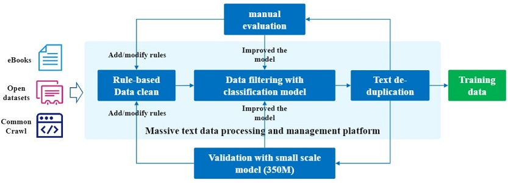
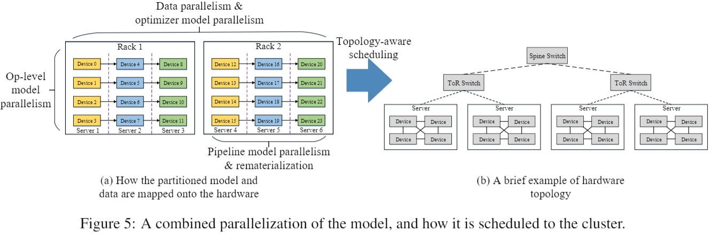
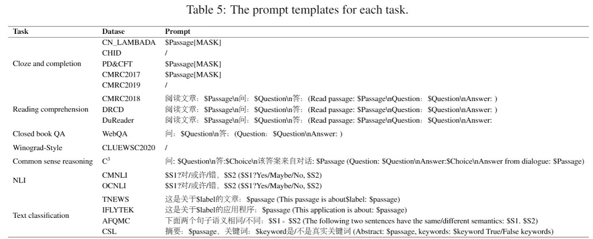
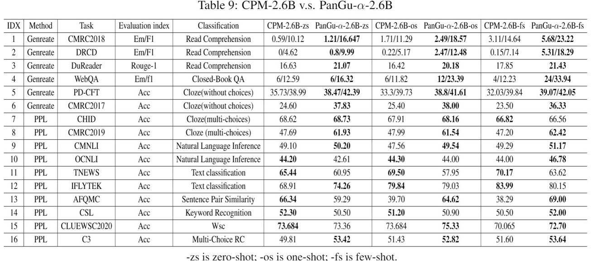
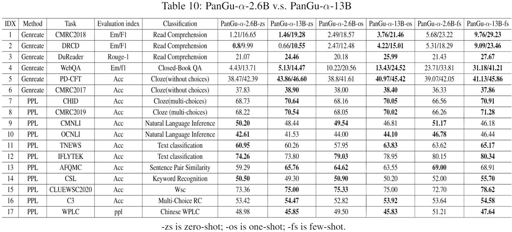
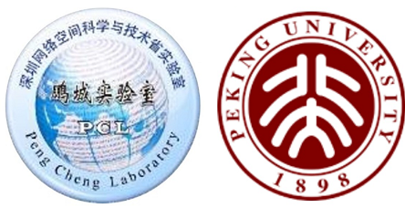

# PanGu-α
This repository is cloned from [OpenI](https://git.openi.org.cn/PCL-Platform.Intelligence/PanGu-Alpha).

PanGu-α is a 200B parameter autoregressive pretrained Chinese language model develped by Huawei Noah's Ark Lab, MindSpore Team and Peng Cheng Laboratory.

## 鹏程.盘古α介绍

「鹏程.盘古α」由以鹏城实验室为首的技术团队联合攻关，首次基于“鹏城云脑Ⅱ”和国产MindSpore框架的自动混合并行模式实现在2048卡算力集群上的大规模分布式训练，训练出业界首个2000亿参数以中文为核心的预训练生成语言模型。鹏程.盘古α预训练模型支持丰富的场景应用，在知识问答、知识检索、知识推理、阅读理解等文本生成领域表现突出，具备很强的小样本学习能力。
 [[技术报告](https://git.openi.org.cn/PCL-Platform.Intelligence/PanGu-Alpha/src/branch/master/PANGU-%ce%b1.pdf)]
 [[模型下载](#模型下载)]
 [[模型压缩](#模型压缩)]
 [[评测数据集下载](https://git.openi.org.cn/PCL-Platform.Intelligence/Chinese_WPLC)]
 [[serving展示视频下载](#serving展示视频下载)]
 [[MindSpore官网](https://mindspore.cn/)]
 [[加入微信交流群](#微信交流群)]

### 要点

- **业界首个2000亿参数中文自回归语言模型「鹏程.盘古α」**
- **代码、模型逐步全开源**
- **首创顺序自回归预训练语言模型ALM**
- **MindSpore超大规模自动并行技术**
- **模型基于国产全栈式软硬件协同生态（MindSpore+CANN+昇腾910+ModelArts）**

### 数据集

海量语料是预训练模型研究的基础，联合团队从开源开放数据集、common crawl网页数据、电子书等收集了近80TB原始数据。

<br/>

搭建了面向大型语料库预处理的分布式集群，通过数据清洗过滤、去重、质量评估等处理流程，构建了一个约1.1TB的高质量中文语料数据集，经统计Token数量约为250B规模。通过对不同的开源数据集独立进行处理，完全清除了跟下游任务相关的标签信息，以保证源数据的无偏性。

### 模型结构

<br/>

query层堆叠在transformer层之上。query层的基本结构与transformer层相似，只是引入了一个额外的Query layer，来预测生成下一个query Q的位置。

### MindSpore超大规模自动并行

大集群下高效训练千亿至万亿参数模型，用户需要综合考虑参数量、计算量、计算类型、集群带宽拓扑和样本数量等才能设计出性能较优的并行切分策略，模型编码出来考虑算法以外，还需要编写大量并行切分和通信代码。

<br/>

MindSpore是业界首个支持全自动并行的框架，MindSpore多维度自动并行，通过数据并行、算子级模型并行、Pipeline模型并行、优化器模型并行、异构并行、重计算、高效内存复用，及拓扑感知调度，实现整体迭代时间最小（计算时间+通信时间）。编程接口高效易用，实现了算法逻辑和并行逻辑解耦，串行代码自动分布式并行。

| 硬件平台     |设备数量  | 操作系统               | 集群管理        |框架         |
| :----------|:------- | :------------------- | :------------ |:------------|
| Ascend 910 |2048     | EulerOS-aarch64      | ModelArts️   |MindSpore    |

### 模型下载

大集群训练时，模型采用分片保存，2.6B和13B模型下载链接如下。

| 模型          | 大小   | 来源  |md5|
| :-------------- | :---- | :------------------------------------------------------------ |:-------------------- |
| 鹏程.盘古α-2.6B       | 2.6G |[2.6B_part0](https://git.openi.org.cn/attachments/59fac5b4-ec54-493f-95ba-d0b724f39ed6) |3904bb0e551f36206cfca96ab0f63cba   |
| 鹏程.盘古α-2.6B       | 2.6G |[2.6B_part1](https://git.openi.org.cn/attachments/6535b42b-67b5-469b-9506-067c5c5768e0) |19407cbc33ee4929d68f500e015869cc   |
| 鹏程.盘古α-2.6B       | 2.6G |[2.6B_part2](https://git.openi.org.cn/attachments/4dd9178d-43cb-47aa-b299-1c0bfe38c343) |9ce140312f962079e13f91f681a269ad   |
| 鹏程.盘古α-2.6B       | 2.6G |[2.6B_part3](https://git.openi.org.cn/attachments/c1acd001-03ec-4484-ab31-4b3636603d50) |290158ffc426a89b7e357018c701e71d   |
| 鹏程.盘古α-2.6B       | 391M |[2.6B_word_embedding](https://git.openi.org.cn/attachments/12319797-b0ce-4563-99e6-4f6a7d3ec0cb) |9ca91161bde9c089dd8304db0428455e   |
| 鹏程.盘古α-2.6B       | 10M  |[2.6B_top_query_embedding](https://git.openi.org.cn/attachments/287dc9a4-8c81-4132-ad4d-d2e350701ba3) |320b401050319c1c63117c36b93651c1   |
| 鹏程.盘古α-2.6B       | 10M  |[2.6B_position_embedding](https://git.openi.org.cn/attachments/1f0f3dcb-9d82-4d59-84c0-3d6bade7de2f) |bf7eb84b7b9fd6004cb22260883ab080   |
| 鹏程.盘古α-13B        | 12G  |[13B_part0](https://git.openi.org.cn/attachments/341df568-12e7-4dad-afa4-612bd9181b41)  |724bdaf87e0eb4aa9ca0f35e8af92464   |
| 鹏程.盘古α-13B        | 12G  |[13B_part1](https://git.openi.org.cn/attachments/bc6142f0-dee3-41bd-98b3-d8c9f75a6843)  |493579a1ccc2a16a616cf04daedd031f   |
| 鹏程.盘古α-13B        | 12G  |[13B_part2](https://git.openi.org.cn/attachments/15be215d-d488-4eee-9780-aea3c56efa47)  |de4e8a023c56b7134bff4dfbcc230871   |
| 鹏程.盘古α-13B        | 12G  |[13B_part3](https://git.openi.org.cn/attachments/695f935a-5b4e-42e2-adaf-962fcb742382)  |6a6bcfdadf5a0d23c567d6959bf4eaba   |
| 鹏程.盘古α-13B        | 781M |[13B_word_embedding](https://git.openi.org.cn/attachments/a4f86058-86a7-40de-8b39-6c35242b206f)  |a4e0c5893d255500396dfa1bfe7ba3ba  |
| 鹏程.盘古α-13B        | 20M  |[13B_top_query_embedding](https://git.openi.org.cn/attachments/22d49fa2-5aa9-4d3f-9d77-3f491350ffc0)  |4d75c3b42f85db825cebdc99329160bd   |
| 鹏程.盘古α-13B        | 20M  |[13B_position_embedding](https://git.openi.org.cn/attachments/76e796fa-0d97-48ea-8e2c-f49bb2f2b21b)  |299ee4174cc4de7fdebec1c3e631e348   |
| 鹏程.盘古α-200B       |  ~T  |  敬请期待                                                                                |   |

### 环境要求
| 硬件平台       | 操作系统         |框架         |2.6/13B推理设备数量  |200B推理设备数量  |
| :------------|:--------------- |:---------- |:------------------|:---------------|
| Ascend 910    | EulerOS-aarch64 |MindSpore   |8卡               |64卡             |  

环境配置
```bash
mindspore
jieba 0.42.1
sentencepiece 0.1.94
```
### 训练

运行如下命令开始训练， `MODE` 选择 `2.6B`, `13B` 或 `200B`. 
```bash
export MODE=2.6B
bash scripts/run_distribute_train.sh 8 /home/data/ /home/config/rank_table_8p.json $MODE
```
### 推理

首先下载以下三个文件
- tokenizier: vocal.vocab 和 vocab.model 在“$FILE_PATH/tokenizer/”目录
- 模型: 下载模型文件放在“$FILE_PATH/checkpiont_file/”目录
- 策略文件: 该文件描述了模型的切分策略，文件位于”$FILE_PATH/strategy_load_ckpt/“目录

执行推理
```bash
$FILE_PATH=/home/your_path
bash scripts/run_distribute_predict.sh 8 /home/config/rank_table_8p.json ${FILE_PATH}/strategy_load_ckpt \ 
${FILE_PATH}/tokenizer/  ${FILE_PATH}/checkpiont_file filitered 
```
### 模型压缩
将鹏程.盘古α-13B由8卡压缩到1卡上推理[[参见](https://git.openi.org.cn/PCL-Platform.Intelligence/Model-Compression)]

### 下游任务评估

为了评估模型性能，团队收集了16个不同类型的中文下游任务，如下图所示：

<br/>

由于中文缺少在小样本学习领域的benchMark，研究对比了智源研究院发布的首个26亿参数的中文预训练语言模型「悟道·文源」CPM，通过在1.1TB数据中策略抽样了100GB等量数据集训练了2.6B参数规模的「鹏程.盘古α」模型，并在已收集的16个下游任务上进行了对比，结果如下表所示：

<br/>

实验结果表明鹏程.盘古α-2.6B比CPM-2.6B模型具有更强的语言学习能力，特别是在小样本学习和生成任务方面。在生成任务方面, 鹏程.盘古α-2.6B比CPM-2.6B性能指标平均提升6.5个百分点。在PPL任务方面，鹏程.盘古α-2.6B在OCNLI、TNEWS和IFLYTEK任务上略弱于CPM。这一现象归因于模型使用了更大规模的词表，这使得模型在局部文本变化时对困惑度不敏感。

<br/>

团队还对比了鹏程.盘古α-13B和鹏程.盘古α-2.6B模型在这些下游任务上的表现，在所有的生成任务和大部分的PPL任务上，13B的模型性能优于2.6B。在CMRC2018、DRCD和WebQA任务中，小样本学习比零样本学习指标高出10分以上，说明鹏程.盘古α-13B模型具有较强的小样本学习能力。在NLI和文本分类任务上，鹏程.盘古α-13B与鹏程.盘古α-2.6B的性能相当，这些任务对于生成语言模型来说通常是困难的，而且模型改进的机会很大，这将是团队未来的工作。鹏程.盘古α-200B的模型文件大小在TB级别，下游任务推理耗时耗力，还有更多优化加速的空间，团队正在共同努力完成推理和测评，尽快同步相关研究成果。
部分生成举例：


```bash
Input: 上联：欢天喜地度佳节 下联：
Generate: 花好月圆庆团圆

Input: 小红是小明的姐姐，小红的年纪比小明
Generate: 大

Input: 中国和美国和日本和法国和加拿大和澳大利亚的首都分别是哪里？
Generate: 中国的首都是北京,美国的首都是华盛顿,日本的首都是东京,法国的首都是巴黎,澳大利亚的首都是堪培拉。

Input: 四川的省会是哪里？
Generate: 成都,简称蓉,别称蓉城、锦城、天府之国,是四川省省会、副省级市、特大城市、中国西部地区重要的中心城市、国家重要的现代制造业基地、西南地区综合交通枢纽。

Input: 李大钊如果在世，他会对今天的青年人说：
Generate: “如果我们多读点书，多观察一点国家社会的实况，遇事能多些思考，多些辨别，就不会被清和军阀的残暴统治所吓倒，不被他们那一套盲目排外的舆论所迷惑。”“我们要组织大批的有志青年，拿起笔来，到学校里去，把我们的眼睛，耳朵，都用到学校上去，用到社会上去，使我们的思想和行动，都能反映出全国人民的意志，作为我们行动的指南。”

#作者：风吹走的名字链接：https://www.zhihu.com/question/313316339/answer/623572659来源：知乎著作权归作者所有。
Input: 书生：羌笛何须怨杨柳，春风不度玉门关。
       飞云：（这诗怎么这么耳熟？且过去跟他聊聊如何。）
       书生：小兄弟，要不要一起喝一杯？
       飞云：你请我呀？你若是请我，我便和你喝一杯；你若不请我，我便一个人去喝。
       书生：小兄弟，看你年纪轻轻，不至于这么势利吧？
       飞云：势利如何说起？你请我喝了酒，我自然要记你的人情；我欠了你的人情，日后你有求于我，我自然要报答你，这样一来大家都不吃   亏，不过你的好处要在后头得到而已。
       书生：小兄弟言之有理，不过在下有一点不太明白，那就是为什么你不愿意先请在下喝了酒待日后在下回报于你呢？
Generate1:你若是愿意先请我喝了酒，待日后我回报于你，你便有了收获，你岂不是更先欠下我的人情了吗？
          飞云：这是自然的，我也说过了，我的确是不喜欢欠别人的人情，更不喜欢别人欠我的人情，那便是把好处在后头得到了。
          书生：小兄弟，我是一介书生，你在座的各位都是我的衣食父母，你们如果都像我一样想要什么，要不到了我，那你们会像我一样被饿死、被寒冷冻死吗？
          飞云：那是因为在座的各位都是饥寒交迫之人，都是饿得骨瘦如柴之人，而我却是经常吃饱喝足、锦衣玉食、养尊处优之人，这正是所谓的乐施善心，积德行善之人。
          书生：小兄弟，你是不是因为这样才不愿意欠下我的人情？
          飞云：不是，因为我知道，你如果不愿意先请我喝了酒待日后我回报于你，那么我便不能报答你。而我不愿意欠别人的人情，那我便会将自己的美好的善行全部都奉献给你，以报答你对我的关怀和帮助。
          书生：小兄弟，不知你用什么方法找到这么多可敬可爱的人们的？
          飞云：呵呵，说来惭愧，我找他们可不是什么难事，我认识他们的时候，他们也还没有这么大的势力，我只是为了帮他们找到一条可以生存的路，从他们那里换到了一些粮食。只是那时候我对他们的帮助确实太少了，所以最后他们都没有答应我的要求，也没有向我索要东西，甚至于没有等到我的帮助便饿死了。
          书生：小兄弟，我看你年纪轻轻，怎么会有如此崇高的思想境界呢？又是从哪里学来的呢？你说来听听。
          飞云：这倒说不上，只不过是我发现了很多常人做不到的事情，所以就学会了很多常人不会去做的事情，所谓饮水思源，这便是其中的一个原因。
          书生：你说的是不是为了一些自己不知道的事物，而发奋图强？
          飞云：是啊，我一直都
Generate2:飞云：咳，年轻人说的话要有选择性，我既然说了我先请你，你却又说一个人喝一杯，可见我是有目的的，要是小兄弟真是不肯给在下好处，也可以不请我，到时候我便跟你说我请      了你，你就欠了我一个人情.若是小兄弟答应我，日后我自然会等你。
          书生：啊，我明白了，这样就不会让你和我喝酒了。
          飞云：对对，小兄弟是有诚信的人，不如这样，你叫在下这样做，我也是这样做，我们就到此为止，日后互不相欠。
          书生：这...难道小兄弟不明白我的意思？
          飞云：我当然明白。
          书生：那我就明白了。
          飞云：怎么？难道你还不明白我的意思吗？
          书生：小兄弟，你相信我了？
          飞云：嗯。
          书生：那你应该明白我的意思，我不是不给你报酬的人，只是我不希望你因为我而耽误了自己的前程，你明白我的意思吗？
          飞云：我当然明白你的意思。
          书生：嗯，这一点我又何需多言？其实刚才我不是也说过了吗？我是一个有诚意的人，我很感谢你能让我明白了这么多，不过小兄弟你既然已经明白了我的意思，就表示你愿意接受我的这份礼物，我说到做到，你看怎么样？
          飞云：哦，那太好了，以后我若有什么困难，你就可以来找我了。
          书生：嗯，小兄弟，说得好。既然你已经接受了我的这份礼物，我也没有什么好说的了，不过你也要答应我，以后在没有我的允许下，你一定要记住，除了我，千万不要在别人面前提起你的家人。
          飞云：嗯。
          书生：我走了。
          飞云：小兄弟慢走，来日再见。
```

### serving展示视频下载

 [[展示视频](https://git.openi.org.cn/PCL-Platform.Intelligence/PanGu-Alpha/src/branch/master/serving_demo/PanGu-Alpha-serving-demo.avi)]

说明：在线serving服务暂时只对鹏城实验室内网开放，对外开放API正在测试优化中，敬请期待！

#### 微信交流群
<br/>

### 项目信息

鹏城实验室和北京大学等相关单位是鹏程.盘古α联合开发团队的主要成员。

<br/>

