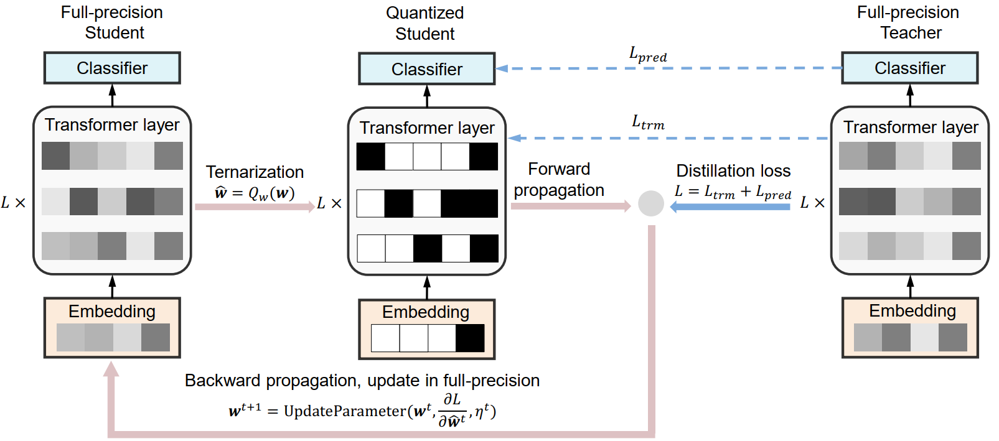

# TernaryBERT

This directory contains code for [TernaryBERT: Distillation-aware Ultra-low Bit BERT](https://arxiv.org/abs/2009.12812).
<br />

<br />
## Envs
```
conda create -n myenv python=3.6
conda activate myenv
pip install -r requirements.txt
```


## GLUE
### Data
Download GLUE
https://github.com/nyu-mll/GLUE-baselines

```
ls data/mnli
```
shows:
```
dev_matched.tsv  dev_mismatched.tsv  train.tsv
```

### Model
Preparing a fine-tuend BERT base model on MNLI
```
ls models/mnli
```
shows
```
config.json  pytorch_model.bin  vocab.txt
```

### Distillation-aware quantization training on MNLI
```
python quant_task_glue.py \
            --data_dir data \
            --model_dir models \
            --task_name mnli \
            --output_dir output \
            --learning_rate 2e-5 \
            --num_train_epochs 3 \
            --weight_bits 2 \
            --input_bits 8 \
            --pred_distill \
            --intermediate_distill \
            --save_fp_model \
            --save_quantized_model
```
More details of arguments are in quant_task_glue.py

## SQuAD

### Data
Download data
https://rajpurkar.github.io/SQuAD-explorer/

### Model
Preparing fine-tuend BERT base model on SQuAD v1.1/v2.0

### Distillation-aware quantization training
```
python quant_task_squad.py \
            --data_dir data/squadv2.0 \
            --model_dir models/squadv2.0 \
            --output_dir output \
            --learning_rate 2e-5 \
            --num_train_epochs 3 \
            --version_2_with_negative \
            --weight_bits 2 \
            --input_bits 8 \
            --pred_distill \
            --intermediate_distill \
            --save_fp_model \
            --save_quantized_model
```

## Reference

```
@inproceedings{zhang-etal-2020-ternarybert,
    title = {TernaryBERT: Distillation-aware Ultra-low Bit BERT},
    author = {Wei Zhang, Lu Hou, Yichun Yin, Lifeng Shang, Xiao Chen, Xin Jiang Xin, Qun Liu}
    booktitle = {Proceedings of the 2020 Conference on Empirical Methods in Natural Language Processing (EMNLP)},
    year = {2020},
}
```


